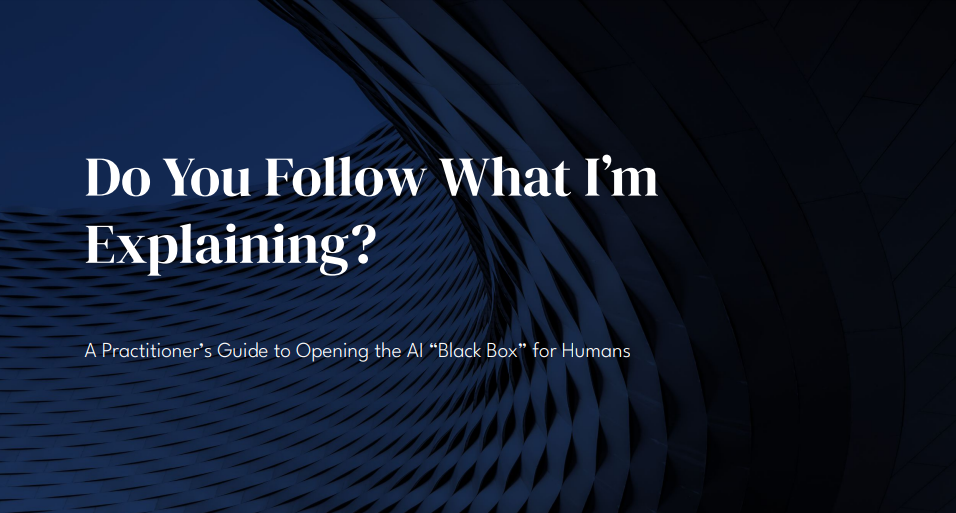

# Do You Follow What I’m Explaining? A Practitioner’s Guide to Opening the AI Black Box for Humans

Kilian Kluge @ PyData Global 2022, [December 1st, 12:00 UTC, Track II](https://global2022.pydata.org/cfp/talk/T3N9MP/)

[Slides (PDF)](https://github.com/ionicsolutions/do-you-follow-what-im-explaining/blob/main/Do%20You%20Follow%20What%20Im%20Explaining%20PyData%20Global%202022.pdf)

## Abstract

Methods and techniques from the realm of artificial intelligence (AI), such as machine learning,
find their way into ever more software and devices.
As more people interact with these highly complex and opaque systems in their private and professional lives,
there is a rising need to communicate AI-based decisions, predictions, and recommendations to their users.

So-called “interpretability” or “explainability” methods claim to allow insights into the proverbial “black boxes.”
Many data scientists use tools like SHAP, LIME, or partial dependence plots in their day-to-day work to analyze and debug models.

However, as numerous studies have shown, even experienced data scientists are prone to interpret the “explanations” generated 
by these tools in ways that support their pre-existing beliefs.
This problem becomes even more severe when “explanations” are presented to end-users in hopes of allowing them to
assess and scrutinize an AI system’s output.

In this talk, we’ll explore the problem space using the example of counterfactual explanations for price estimates.
Participants will learn how to employ user studies and principles from human-centric design 
to implement “explanations” that fulfill their purpose.

No prior data science knowledge is required to follow the talk, but a basic familiarity with the concept of minimizing
an objective function will be helpful.

## Further reading on topics covered in the talk

### Explanation Fundamentals

- Pacer & Lombrozo (2017): _Ockham’s Razor Cuts to the Root: Simplicity in Causal Explanation_ [doi:10.1037/xge0000318](https://doi.org/10.1037/xge0000318)
- Miller (2019): _Explanation in artificial intelligence: Insights from the social sciences_ [doi:10.1016/j.artint.2018.07.007](https://doi.org/10.1016/j.artint.2018.07.007)

### Evaluating Explanations

- Doshi-Velez & Kim (2017): _Towards A Rigorous Science of Interpretable Machine Learning_ [arXiv:1702.08608](https://arxiv.org/abs/1702.08608)
- Förster et al. (2020): _Evaluating Explainable Artifical Intelligence – What Users Really Appreciate_ [ECIS 2020 Proceedings](https://web.archive.org/web/20220803134652id_/https://aisel.aisnet.org/cgi/viewcontent.cgi?article=1194&context=ecis2020_rp)

### Meaningful Explanations
- Förster et al. (2020): _Fostering Human Agency: A Process for the Design of UserCentric XAI Systems_ [ICIS 2020 Proceedings](https://web.archive.org/web/20220802073726id_/https://aisel.aisnet.org/cgi/viewcontent.cgi?article=1064&context=icis2020)
- Keane (2021): _If Only We Had Better Counterfactual Explanations: Five Key Deficits to Rectify in the Evaluation of Counterfactual
XAI Techniques._ [Proceedings of the Thirtieth International Joint Conference on Artificial Intelligence](https://www.ijcai.org/proceedings/2021/0609.pdf)

### Misleading Explanations

- Lakkaraju & Bastani (2020): _"How Do I Fool You?": Manipulating User Trust via Misleading Black Box Explanations._ [Proceedings of the AAAI/ACM Conference on AI, Ethics, and Society](https://dl.acm.org/doi/pdf/10.1145/3375627.3375833)
- Kaur et al. (2020): _Interpreting Interpretability: Understanding Data Scientists’ Use of Interpretability Tools for Machine Learning_ [Proceedings of the 2020 CHI Conference on Human Factors in Computing Systems](http://www.jennwv.com/papers/interp-ds.pdf)

### Generating Meaningful Explanations for Real Estate Price Predictions

- Verma et al. (2022): _Counterfactual Explanations and Algorithmic Recourses for Machine Learning: A Review_ [arXiv:2010.10596](https://arxiv.org/abs/2010.10596)
- Förster et al. (2021): _Capturing Users’ Reality: A Novel Approach to Generate Coherent Counterfactual Explanations_ [Proceedings of the 54th Hawaii International Conference on System Sciences](https://scholarspace.manoa.hawaii.edu/server/api/core/bitstreams/947e7f6b-c7b0-4dba-afcc-95c4edef0a27/content)
- Förster et al. (2022): _User-centric explainable AI: design and evaluation of an approach to generate coherent counterfactual explanations for structured data_ [doi:10.1080/12460125.2022.2119707](https://doi.org/10.1080/12460125.2022.2119707)

## Explainable AI Slack Community

- [Invite Link](https://join.slack.com/t/explainableaiworld/shared_invite/zt-1ksm9yk8k-px88Tu9_fFuU7Zl2iDFvuQ)
- If the link is no longer valid, send a message to [@XAI_Research on Twitter](https://www.twitter.com/XAI_Research) or _explainableaiworld AT gmail DOT com_ to receive an invite
## Affiliations

- [Inlinity](https://www.inlinity.ai) ([LinkedIn](https://www.linkedin.com/company/inlinity/))
- [XAI Studio](https://www.xai-studio.de) ([LinkedIn](https://www.linkedin.com/company/xai-studio/))
